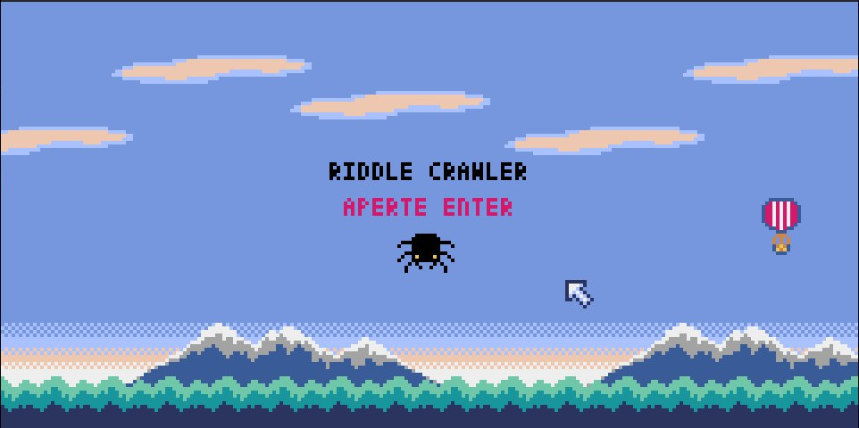
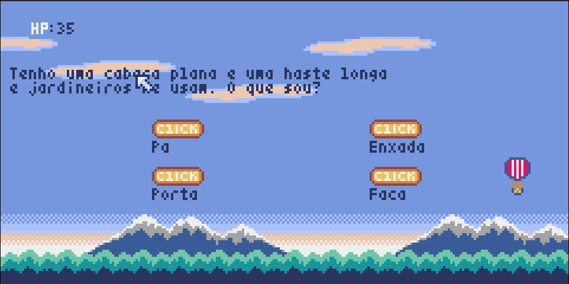
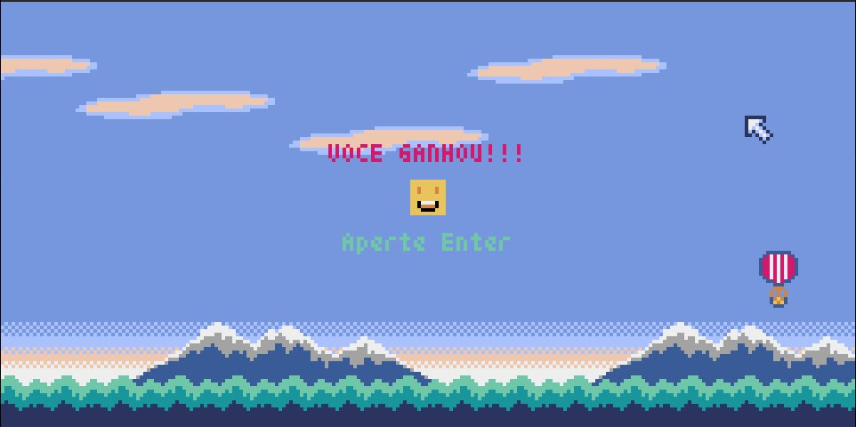
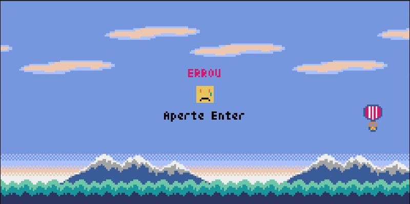

# Segundo Menor Caminho com Grafos 2

**Conteúdo da Disciplina**: Grafos 2<br>

## Alunos
|Matrícula | Aluno |
| -- | -- |
| 21/1039662  |  Pedro Henrique da Silva Melo |
| 20/2063300  |  João Pedro Rodrigues Morbeck |

## Sobre 
O objetivo do projeto é utilizar o Algoritmo de Dijkstra em um jogo de perguntas e escolhas que envolvem charadas que devem ser desvendadas para achar o menor caminho de menor custo do grafo gerado pelo Algoritmo de Dijkstra. 

O uso de grafos e Dijkstra faz com que seja mais fácil de controlar a aleatoriedade dos resultados dados por uma função de geração pseudo-aleatória.

Vídeo de apresentação se encontra na pasta assets ou no seguinte [link](https://youtu.be/uaFrsWE8Vpo)

## Screenshots






## Instalação 
**Linguagem**: Python<br>
**Framework**: Pyxel<br>
Descreva os pré-requisitos para rodar o seu projeto e os comandos necessários.

Para começar, baixe o [download oficial da linguagem](https://www.python.org/downloads/).

É preciso instalar o framework Pyxel, uma engine para criação de jogos retrô, sua documentação pode ser encontrada no seguinte [link](https://pypi.org/project/pyxel/).

## Como instalar

### Windows

Após instalar o [Python3](https://www.python.org/) (versão 3.7 ou superior), execute o seguinte comando:

```sh
pip install -U pyxel
```

Se instalar Python utilizando o instalador oficial, verifique a caixa de verificação `Add Python 3.x to PATH` para activar o comando `pyxel`.

### Mac

Após instalar o [Python3](https://www.python.org/) (versão 3.7 ou superior), execute o seguinte comando:

```sh
python3 -m pip install -U pyxel
```

Se utilizar Python3, que é instalado por defeito no Mac, adicione `sudo` ao início do comando acima para activar o comando `pyxel`.

### Linux

Após instalar o pacote SDL2 (`libsdl2-dev` no Ubuntu), [Python3](https://www.python.org/) (versão 3.7 ou superior), e `python3-pip`, execute o seguinte comando:

```sh
sudo pip3 install -U pyxel
```

Se o acima mencionado não funcionar, tente auto-construir-se de acordo com as instruções em [Makefile](../Makefile).

Instale a biblioteca libsdl2-dev com o comando:

```sh
sudo apt-get install libsdl2-dev
```
### Rodando o jogo
Para rodar o programa, execute o executável do arquivo Riddle_Crawler.py ou tente escrever no terminal:

```sh
pyxel run Riddle_Crawler.py
```

## Uso 
Ao rodarmos o jogo, estaremos na tela inicial. Para iniciar o jogo das charadas devemos apentar Enter. Caso queira fechar o jogo, basta apertar Q ou clicar no X da janela do jogo. 

Com isso, teremos uma charada e teremos que adivinhar de que palavra que se trata, tendo 4 palavras como opção para o jogador escolher por meio dos botões apresentados na tela. 


O jogador vai ter uma quantidade de vida contabilizada pelos pontos, indicado por HP no topo da tela. Sempre que uma palavra errada for escolhida, o jogador perde de 10 a 15 pontos de vida, se o contador chegar a 0, o jogador perde o jogo.


Além disso, existem palavras que possam ser respostas para a charada, mas não fazem parte do grafo, são chamadas de traps. Caso o jogador acabe escolhendo uma palavra que é uma trap, então ele perde 25 pontos de vida.

Se o jogador escolher corretamente as palavras, seguindo o caminho do grafo até o último nó, então ele vence o jogo!

